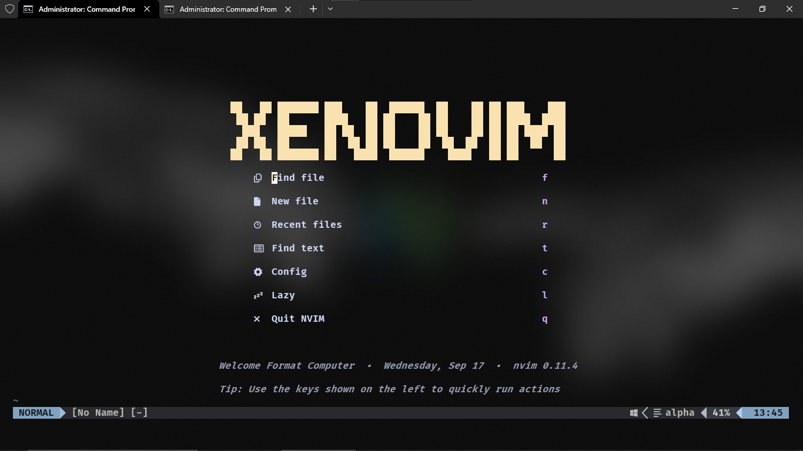
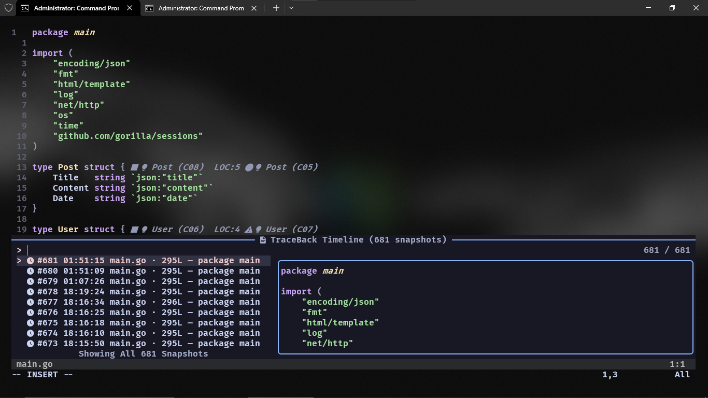
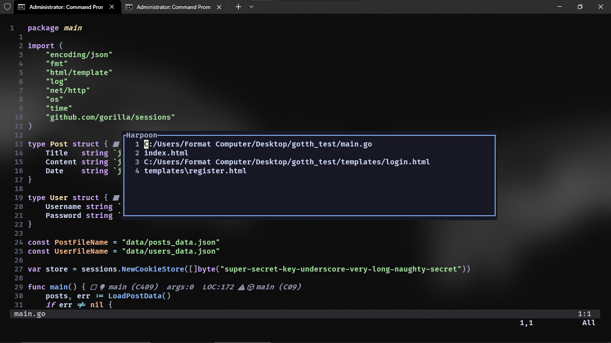
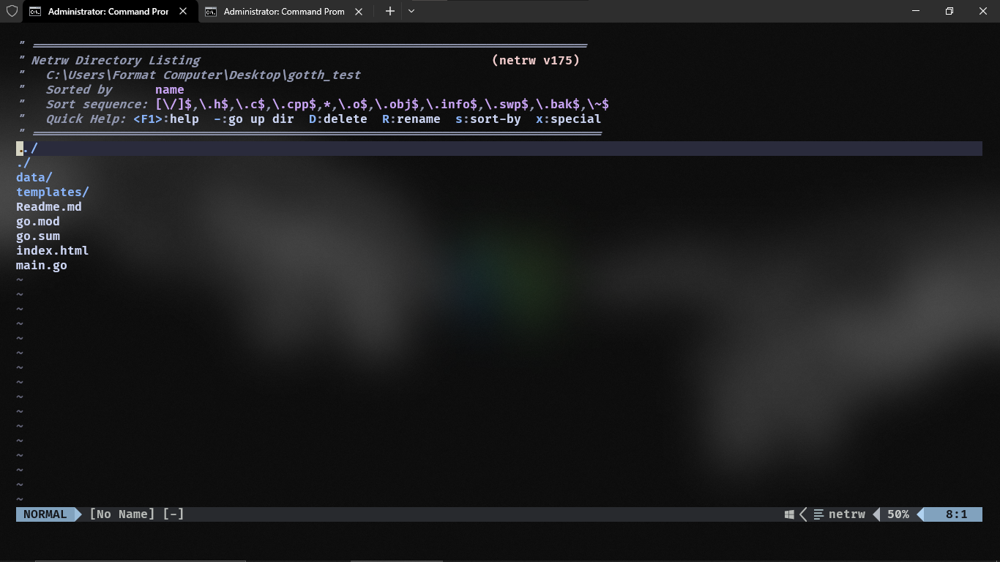

# The Awakener — Neovim Configuration

Opinionated, lightweight Neovim config powered by `lazy.nvim`, with sensible defaults and a curated plugin set.

Highlights:
- TraceBack: my own all‑in‑one time‑travel, history, and code‑context plugin with Telescope integration — see [theawakener0/TraceBack](https://github.com/theawakener0/TraceBack)
- Harpoon (by the best and only ThePrimeagen): lightning‑fast file navigation — see [ThePrimeagen/harpoon](https://github.com/ThePrimeagen/harpoon)
- Treesitter syntax, LSP via Mason, completion (nvim‑cmp + LuaSnip), Telescope, Catppuccin theme, Lualine, Git tooling, dashboard, and utilities

This README shows how to install, use, and customize the config.

## Requirements

- Neovim 0.11+
- Git (for plugin installs)
- ripgrep (recommended for Telescope live_grep)
- Optional/Language-specific tools for best results:
  - LSPs via Mason: installs language servers, but you still need language runtimes/toolchains (Node.js for tsserver/html/cssls, Python for pyright, Go for gopls, C/C++ toolchain for clangd, etc.)
  - Formatters/linters used by none-ls: install on your system if you want formatting/diagnostics
    - stylua, prettier

## Quick install

1) Backup any existing Neovim config.

2) Place this repo’s `nvim` folder as your Neovim config directory:

- Linux/macOS: `~/.config/nvim`
- Windows (native): `%USERPROFILE%\AppData\Local\nvim` (aka `%LOCALAPPDATA%\nvim`)
- WSL: `~/.config/nvim`

Examples (Git Bash/WSL):

```bash
# from your desired parent dir, e.g. ~/.config
git clone <your-dotfiles-repo-url> theawakener-dotfiles
cp -r theawakener-dotfiles/nvim ~/.config/nvim
# or create a symlink if you prefer
ln -s ~/path/to/theawakener-dotfiles/nvim ~/.config/nvim
```

3) Start Neovim. It will bootstrap `lazy.nvim` and install plugins on first run.

4) Run `:Lazy` to view progress; restart Neovim once installs complete.

## What’s included

- Bootstrap: `init.lua` sets up `lazy.nvim`, loads `lua/vim-opt.lua` and `lua/plugins/*`.
- Options: `lua/vim-opt.lua` sets editor basics and leaders (space / backslash).
- Plugins (see `lua/plugins/`):
  - Theme: `catppuccin/nvim` (flavour: mocha)
  - UI: `goolord/alpha-nvim` (dashboard), `nvim-lualine/lualine.nvim`
  - Files & Search: `nvim-telescope/telescope.nvim` + `telescope-ui-select`
  - Syntax: `nvim-treesitter/nvim-treesitter`
  - LSP: `neovim/nvim-lspconfig`, `williamboman/mason.nvim`, `mason-lspconfig.nvim`
  - Completion: `hrsh7th/nvim-cmp`, `cmp-nvim-lsp`, `L3MON4D3/LuaSnip`, `cmp_luasnip`, `rafamadriz/friendly-snippets`
  - Git: `tpope/vim-fugitive`, `lewis6991/gitsigns.nvim`
  - Utilities: `windwp/nvim-autopairs`, `folke/which-key.nvim`, `folke/todo-comments.nvim`
  - Formatting/Diagnostics: `nvimtools/none-ls.nvim` (stylua, prettier, rubocop, erb_lint wired)
  - Navigation: `ThePrimeagen/harpoon` (harpoon2 branch)
  - AI: `github/copilot.vim`
  - Presence: `vyfor/cord.nvim`
  - Extra: `theawakener0/TraceBack` (with Telescope integration)

Files of interest:
- `init.lua` — entry point and plugin bootstrap
- `lua/vim-opt.lua` — editor options and leader keys
- `lua/plugins/*.lua` — one file per plugin or group

## Keymaps

- Explorer: `<Leader>e` open Ex (netrw)
- Telescope: `<Leader>ff` find files, `<Leader>fg` live grep
- LSP: `K` hover, `<Leader>gd` go to definition, `<Leader>gr` references, `<Leader>ca` code action
- Formatting: `<Leader>gf` format buffer (via LSP/none-ls)
- Git signs: `<Leader>gp` preview hunk, `<Leader>gt` toggle line blame
- Which-key: press `<Leader>` to see available mappings pop up

Harpoon (ThePrimeagen):
- `<Leader>ha` add file to list
- `<Leader>hh` toggle quick menu
- `<Leader>h1..h4` jump to slot 1..4
- `<Leader>hn` / `<Leader>hp` cycle next/prev

TraceBack (by me):
- `<Leader>tt` timeline, `<Leader>th` history
- `<Leader>tc` capture snapshot, `<Leader>tr` restore, `<Leader>tp` replay
- `<Leader>ts` toggle security lens

Note: `<Leader>` is space. Local leader is `\`.

## Screenshots

Below are a few screenshots of the setup in action. If they don’t render on GitHub, place your images under `assets/` with the filenames shown below.









## LSP and formatting

- Mason installs and manages language servers automatically (`auto_install = true`). Open `:Mason` to review/adjust.
- Servers configured: `ts_ls`, `html`, `cssls`, `lua_ls`, `clangd`, `pyright`, `gopls`.
- none-ls provides extra formatting/diagnostics. Ensure the underlying tools are installed on your system, e.g.:
  - stylua (Lua) — e.g., `cargo install stylua` or use your package manager
  - prettier (web) — `npm i -g prettier`
  - rubocop, erb_lint (Ruby) — `gem install rubocop erb_lint`

## Customize

- Add plugins: drop a new spec into `lua/plugins/` (see existing files for pattern).
- Change options: edit `lua/vim-opt.lua` (tabs, shiftwidth, leaders, numbers, etc.).
- Change keymaps/config: edit the related file in `lua/plugins/` and adjust its `config` block.
- Theme flavour: change `flavour = "mocha"` in `lua/plugins/colors.lua` to `macchiato`/`frappe`/`latte`.

Optional per-machine overrides: you can create `lua/user.lua` and then require it from `init.lua` if you want to keep local tweaks out of version control.

## Troubleshooting

- Plugins didn’t install: `:Lazy sync` (or `:Lazy install`) and restart Neovim.
- Live grep shows no results: install ripgrep and ensure it’s on your PATH.
- Treesitter errors/missing highlight: run `:TSUpdate`; check `ensure_installed` in `lua/plugins/treesitter.lua`.
- LSP not attaching: check `:Mason` for server status; ensure runtime/toolchain (Node/Python/Go/etc.) is installed.
- Formatting doesn’t run: install the external tools used by none-ls (stylua/prettier/rubocop/erb_lint).
- Windows glyphs look odd: install a Nerd Font and select it in your terminal.

## Notes

- This README covers the `nvim` folder; integrate into your dotfiles as you prefer (copy/symlink).
- The config bootstraps `lazy.nvim` (stable) on first run.
- Shout‑out to ThePrimeagen for Harpoon — one of the best navigation plugins out there — and check out my TraceBack plugin for time‑travel debugging and code context.


